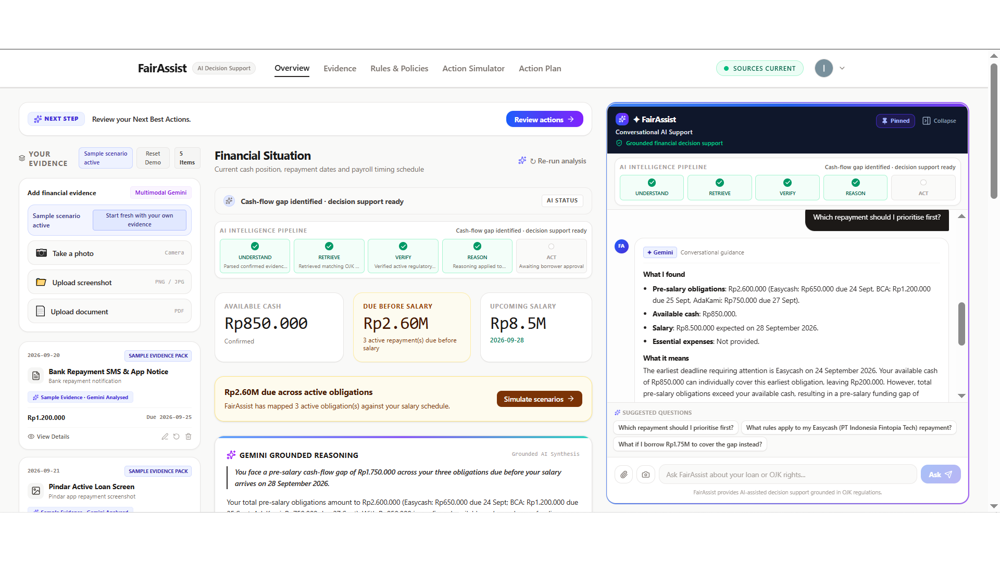
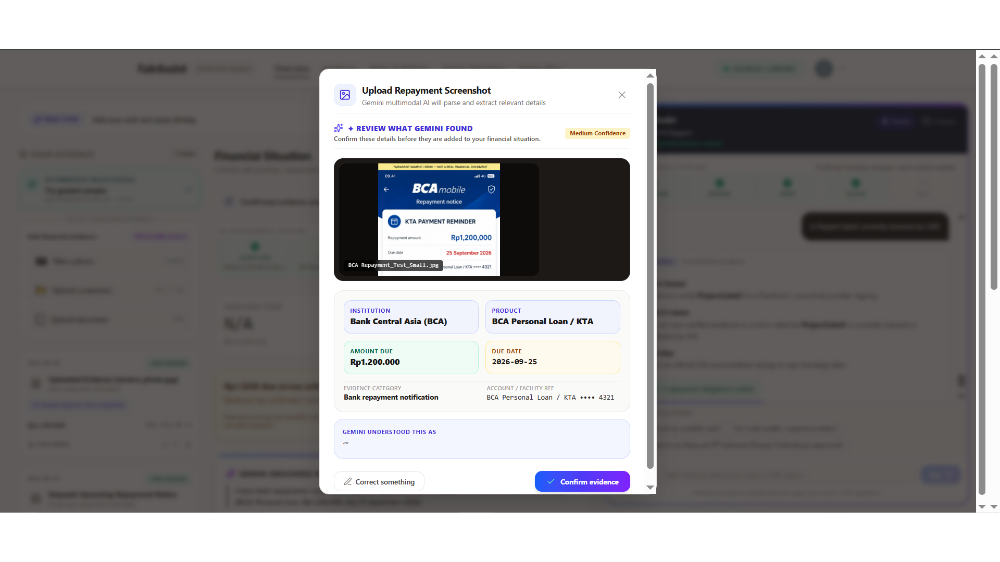
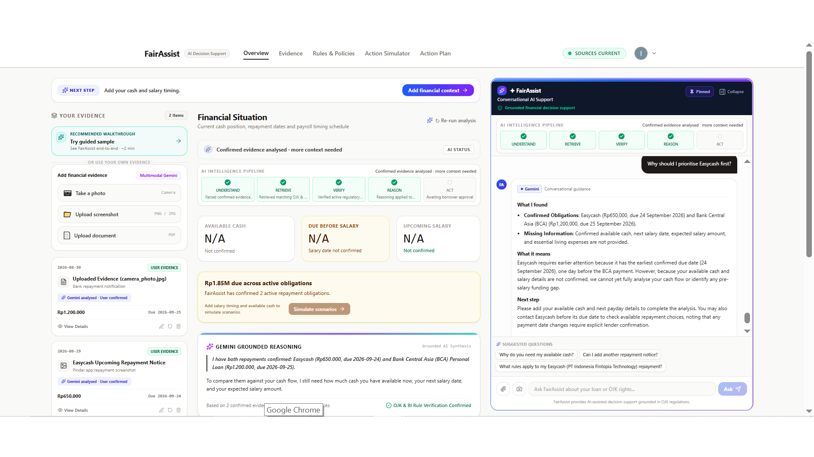
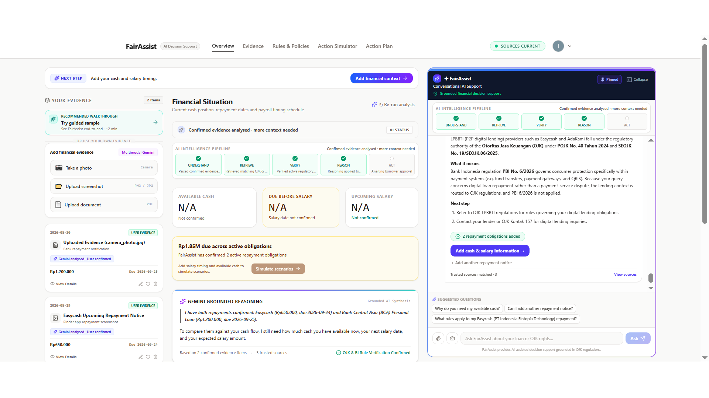
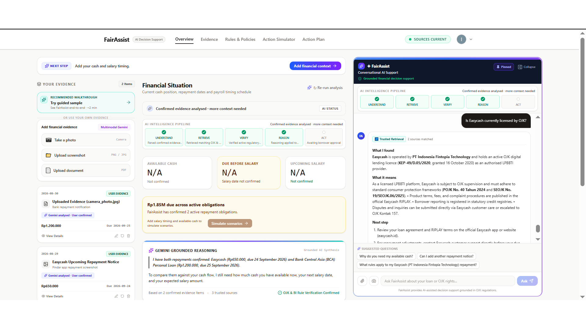
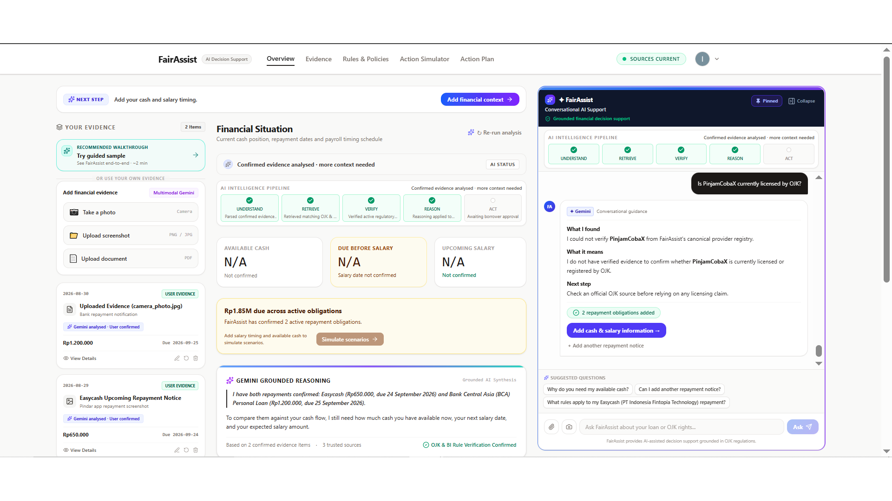
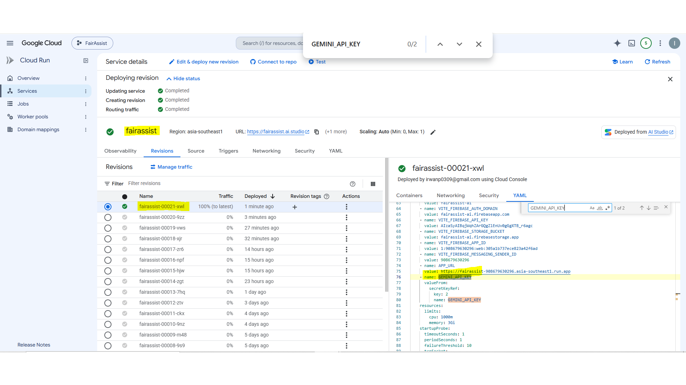
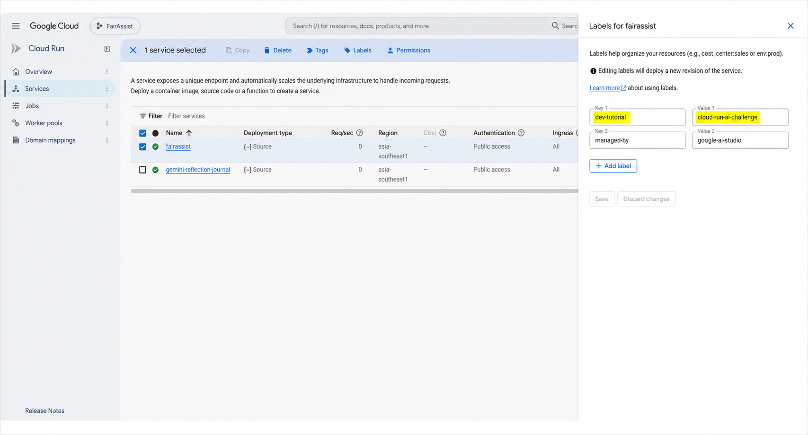

# FairAssist

**Evidence-grounded Conversational AI for responsible repayment decisions in Indonesia.**

FairAssist is a customer-facing AI decision-support agent that helps borrowers understand repayment obligations, financial timing, relevant regulatory context, and responsible next steps without taking the final decision away from the borrower.

It combines **confirmed financial evidence, conversational reasoning, deterministic financial calculations, provider-aware regulatory grounding, and explicit human control** to answer three practical questions:

> **What needs my attention?**  
> **What information is still missing?**  
> **What can I responsibly explore next?**

**Technology:** Google Agent Development Kit (ADK) · Gemini · Retrieval-Augmented Generation (RAG) · Firebase Authentication · Cloud Firestore · Google Cloud Secret Manager · Google Cloud Run

> **FairAssist is decision support, not autonomous financial action.** It does not execute payments, contact lenders automatically, approve repayment arrangements, guarantee restructuring, or replace professional financial or legal advice.

## Live Project

- **Production:** https://fairassist-908679630296.asia-southeast1.run.app/
- **Demo video:** https://youtu.be/xEw1OSPvJv8
- **Repository:** https://github.com/IrwanP/fairassist

---

## 1. End-to-End Experience

FairAssist brings the complete borrower-support workflow into one conversational workspace:

1. authenticate securely;
2. add or capture repayment evidence;
3. let Gemini extract structured details;
4. confirm the evidence before it becomes financial context;
5. ask conversational questions about repayment priorities;
6. retrieve and verify applicable regulatory/provider information;
7. reason over confirmed obligations and timing;
8. simulate possible actions;
9. keep every external action under borrower control.



---

## 2. Problem

Repayment stress is often not only an income problem. It can also be a **timing, evidence, and decision-context problem**.

A borrower may have:

- several repayment dates close together;
- limited cash before payday;
- evidence spread across screenshots, apps, messages, and documents;
- uncertainty about which obligation needs attention first;
- incomplete understanding of lender-specific or regulatory information;
- no clear distinction between **deadline priority** and **actual cash allocation**.

Generic chat advice is not enough for this situation. The assistant needs to know which facts are confirmed, what is still missing, which rules actually apply, and where the AI must stop.

FairAssist converts those fragmented signals into a structured and explainable decision context.

---

## 3. Why Conversational AI

FairAssist is designed first as a **Conversational AI experience**, not as a static compliance dashboard.

A borrower can ask:

- *Which repayment should I prioritise first?*
- *Why should I prioritise Easycash first?*
- *What information do you still need from me?*
- *What current rules apply to this repayment?*
- *Is this provider currently verified?*
- *What happens if I cannot cover all repayments before payday?*

The conversation retains the financial context built from confirmed evidence, so follow-up questions can be answered without forcing the user to restate the situation.

The key design principle is:

> **AI can support the decision. The borrower should still own it.**

---

## 4. Ideathon Challenge Alignment

FairAssist preserves the **Secure Personal Gemini Journal** security foundation while extending it into an original customer-facing financial decision-support use case.

| Explainer / Challenge Area | FairAssist Evidence |
|---|---|
| **Gemini** | Multi-turn conversational reasoning and multimodal financial-evidence extraction |
| **Firebase Authentication** | Google Sign-In is the authoritative identity boundary |
| **Cloud Firestore** | User-owned state is persisted under owner-isolated paths |
| **Secret Manager** | Production `GEMINI_API_KEY` is injected from Google Cloud Secret Manager |
| **Cloud Run** | Production service runs in `asia-southeast1` |
| **Required challenge label** | `dev-tutorial=cloud-run-ai-challenge` |
| **Innovation** | Evidence-grounded repayment reasoning, multimodal evidence, provider-aware grounding, unknown-provider fail-closed handling, Action Simulator, HITL |
| **Architecture Quality** | ADK orchestration, server-side Gemini, deterministic financial boundary, isolated persistence, explicit source provenance |
| **UX** | Conversational follow-ups, guided sample, evidence review, visible AI pipeline, suggested questions, action simulation |
| **Security Compliance** | Authenticated ownership, Firestore rules, Secret Manager, no plaintext production Gemini key, fail-closed provider/regulatory claims |

FairAssist therefore uses the secure challenge foundation **as a platform**, not as the final product itself.

---

## 5. Technology Foundation

| Layer | Technology | Role |
|---|---|---|
| **Agent orchestration** | **Google Agent Development Kit (ADK)** | Coordinates conversational reasoning and agent/tool responsibilities |
| **Generative AI** | **Gemini** | Conversational reasoning and multimodal evidence extraction |
| **Grounding** | **RAG + canonical trusted-source registry** | Query-time selection of applicable regulatory/provider sources with visible provenance |
| **Authentication** | **Firebase Authentication** | Authoritative user identity using Google Sign-In |
| **Persistence** | **Cloud Firestore** | User-isolated financial context and interaction state |
| **Secret management** | **Google Cloud Secret Manager** | Secure runtime injection of the Gemini API key |
| **Runtime** | **Google Cloud Run** | Production managed container deployment |
| **Frontend** | **React 18 + TypeScript + Vite** | Customer-facing web experience |
| **Backend** | **Express + TypeScript** | Authenticated API boundary and server-side AI execution |
| **Financial boundary** | **Deterministic calculation logic** | Authoritative amounts, totals, due dates, cash-flow gaps, and simulation arithmetic |

---

## 6. Secure Personal Gemini Journal Foundation

### Firebase Authentication

FairAssist uses **Firebase Authentication with Google Sign-In** as its authoritative identity boundary.

- `AuthContext.tsx` manages authenticated state.
- `AuthGate.tsx` protects the application experience.
- Authenticated API calls attach the Firebase ID token.
- Privileged backend operations verify user identity server-side.
- Demo personas are application data only and are never treated as proof of identity.

### Owner-Isolated Firestore

Private user state is persisted under owner-bound paths such as:

```text
/users/{userId}/interactions/current_session
```

Firestore rules enforce authenticated ownership:

```javascript
rules_version = '2';

service cloud.firestore {
  match /databases/{database}/documents {
    match /users/{userId}/interactions/{interactionId} {
      allow read:
        if request.auth != null
        && request.auth.uid == userId;

      allow write:
        if request.auth != null
        && request.auth.uid == userId
        && request.resource.data.userId == userId;
    }
  }
}
```

### Guided Sample Isolation

FairAssist has two intentionally separated paths:

- **Guided Sample:** fixed synthetic demonstration data.
- **Own Evidence:** authenticated borrower evidence and financial context.

Sample data is quarantined from the authenticated user's persisted financial state to prevent accidental mixing.

### Secret Management

Production secrets are not hardcoded in the repository or browser bundle.

`GEMINI_API_KEY` is read server-side from:

```text
process.env.GEMINI_API_KEY
```

In production it is supplied through **Google Cloud Secret Manager** and referenced by the Cloud Run revision.

---

## 7. Gemini Multimodal Evidence

Borrowers can provide repayment evidence through:

- screenshot upload;
- camera capture;
- PDF/document upload.

Gemini extracts supported fields such as:

- institution;
- product;
- repayment amount;
- due date;
- account/facility reference;
- evidence category;
- confidence and uncertain fields.

The borrower sees a **review step before confirmation**. Extracted data is not silently accepted into financial context.



### Evidence-Before-Assumption

If Gemini cannot confidently support a field from the evidence, FairAssist keeps it uncertain instead of inventing a financial fact.

Uploaded evidence is also treated as untrusted input. Document contents never override authenticated identity or user ownership.

---

## 8. Conversational Prioritisation & Multi-Turn Reasoning

FairAssist distinguishes between two concepts that are easy to conflate:

### Deadline / Attention Priority

Which obligation needs attention first based on confirmed timing.

### Payment Allocation

How available cash should actually be distributed.

An earlier due date does **not** automatically mean the borrower should allocate all available cash to that obligation.

If cash, salary timing, or essential-expense context is missing, FairAssist says what is missing rather than pretending it can complete a full affordability analysis.

A follow-up such as *“Why should I prioritise Easycash first?”* is routed to conversational financial reasoning rather than being misclassified as a provider-verification request.



---

## 9. AI Intelligence Pipeline

FairAssist exposes its reasoning lifecycle through five stages:

```text
UNDERSTAND → RETRIEVE → VERIFY → REASON → ACT
```

### UNDERSTAND
Interpret the question and confirmed evidence.

### RETRIEVE
Select trusted regulatory/provider information relevant to the actual query and obligation type.

### VERIFY
Check source applicability and whether the source is sufficient to support the claim.

### REASON
Combine confirmed evidence, deterministic financial state, and grounded source context.

### ACT
Present next steps while preserving explicit borrower control.

`ACT` does **not** mean autonomous payment or lender interaction.

---

## 10. Regulatory & Provider Grounding

FairAssist uses a **curated canonical trusted-source registry with dynamic query-time applicability routing**.

It is intentionally not an unrestricted web crawler and it does not use model memory as evidence for provider-specific factual claims.

### Regulatory Sources

Configured regulatory references include, where applicable:

- **POJK No. 22 Tahun 2023** — consumer-protection and collection-conduct context.
- **POJK No. 40 Tahun 2024** — core LPBBTI / Pindar regulatory framework.
- **SEOJK No. 19/SEOJK.06/2025** — LPBBTI operational guidance.
- **POJK No. 8 Tahun 2026** — scoped only to its configured LPBBTI transaction-data reporting / Article 187 revocation context.
- **PBI No. 6 Tahun 2026** — routed only when the query genuinely concerns a Bank Indonesia-regulated payment-system/payment-service context.

### OJK vs Bank Indonesia Applicability

FairAssist does not attach Bank Indonesia rules simply because a financial institution or repayment is mentioned.

For an ordinary LPBBTI repayment query, the lending context is routed to the applicable **OJK** framework. Bank Indonesia payment-system rules are used only when the question actually concerns BI-regulated payment-system or payment-service matters.



### BCA Is Not LPBBTI

**Bank Central Asia (BCA) is treated as a commercial bank / bank-credit context, not as an LPBBTI provider.**

The presence of a BCA Personal Loan repayment alongside a fintech-lending obligation does not cause FairAssist to apply LPBBTI rules to BCA.

### Provider-Specific Verification

Provider-specific claims require provider-specific evidence.

A general POJK or SEOJK source is **not enough** to prove that a named provider is currently licensed, registered, authorised, or subject to a particular lender policy.

For configured providers, FairAssist can attach canonical provider evidence. For example, Easycash verification uses its legal entity and canonical OJK licensing reference before stating provider status.



### Unknown-Provider Safe Path

If a named provider cannot be verified from the canonical provider registry, FairAssist fails closed.

It may preserve user-confirmed repayment facts such as:

- provider name;
- amount;
- due date.

But it will **not invent**:

- licensing/registration status;
- fees;
- penalties;
- restructuring terms;
- extension policies;
- provider-specific rights.

Instead, it explicitly states that the provider could not be verified and directs the user to an official source.



### Core Provenance Rule

> **No retrieved evidence = no provider-specific factual claim.**

This applies especially to licence numbers, regulatory status, exact collection rules, fees, penalties, extensions, restructuring, and provider-specific borrower rights.

---

## 11. Deterministic Financial Boundary

Generative AI is not the authority for financial arithmetic.

Deterministic logic remains authoritative for:

- confirmed amounts;
- repayment totals;
- due dates;
- available cash;
- obligations due before payday;
- repayment-only funding gaps;
- scenario calculations.

Gemini may explain and contextualise those values, but it must not silently replace them with unconstrained model calculations.

A numerical funding gap is stated only when sufficient confirmed cash-flow inputs are available. Total confirmed obligations are never relabelled as a funding gap, shortfall, deficit, or cash-flow gap when the required financial context is missing.

---

## 12. Action Simulator

The Action Simulator allows a borrower to explore a possible scenario **before committing to an external action**.

Examples include:

- payment-timing scenarios;
- repayment-date adjustment scenarios;
- evaluating whether additional borrowing mathematically closes a short-term funding gap.

FairAssist does not assume:

- an extension is available;
- a restructuring request will be approved;
- a lender will waive fees;
- a payment-date change is guaranteed.

Any institution-specific arrangement remains subject to lender confirmation.

---

## 13. Human-in-the-Loop Action Lifecycle

FairAssist deliberately separates **recommendation** from **execution**.

```text
AI recommends
→ borrower approves
→ FairAssist prepares
→ borrower sends externally
→ borrower explicitly confirms "I sent this request."
→ only then may ACT be completed
```

Key boundaries:

- approval alone does not complete an action;
- preparation is not external execution;
- FairAssist does not contact lenders automatically;
- FairAssist does not execute payments;
- lender approval is never assumed;
- the borrower remains the final decision maker.

---

## 14. Google Cloud Run & Secret Manager

FairAssist is deployed to **Google Cloud Run** in:

```text
asia-southeast1
```

The production deployment uses secure runtime secret injection.

The production `GEMINI_API_KEY` is referenced from **Google Cloud Secret Manager**, not stored as a plaintext environment-variable value in the active revision.



The production service also retains the required challenge label:

```text
dev-tutorial=cloud-run-ai-challenge
```



### Post-Deployment Verification

After a deployment change, the verification sequence is:

1. new Cloud Run revision becomes Ready;
2. traffic is routed to the intended latest revision;
3. production URL loads from a fresh browser session;
4. authentication works;
5. chat works;
6. grounded regulatory/provider queries work;
7. multimodal evidence analysis works;
8. no production secret is exposed to the client.

---

## 15. Production Verification Matrix

The final FairAssist production candidate was exercised across the following targeted scenarios.

| # | Scenario | Final Result |
|---:|---|:---:|
| 1 | Production authentication | ✅ PASS |
| 2 | Guided Sample activation | ✅ PASS |
| 3 | Financial-state consistency | ✅ PASS |
| 4 | Repayment prioritisation | ✅ PASS |
| 5 | Multi-turn contextual reasoning | ✅ PASS |
| 6 | Constrained-cash guidance | ✅ PASS |
| 7 | Trusted regulatory retrieval | ✅ PASS |
| 8 | Regulatory factuality & claim-to-source provenance | ✅ PASS |
| 9 | Additional-borrowing responsible guardrail | ✅ PASS |
| 10 | Guided Sample vs Own Evidence isolation | ✅ PASS |
| 11 | Screenshot multimodal ingestion | ✅ PASS |
| 12 | Camera multimodal ingestion | ✅ PASS |

**Final targeted regression result: 12 / 12 PASS.**

---

### Final Production Smoke Verification — 2 September 2026

Following the final frontend synchronisation, the production Cloud Run service was re-verified from a fresh authenticated browser session.

- Guided Sample loaded the complete three-obligation scenario without requiring a manual **Re-run analysis**.
- Grounded Reasoning immediately reflected Rp2,600,000 in pre-salary obligations, Rp850,000 available cash, and the deterministic Rp1,750,000 funding gap.
- Repayment prioritisation correctly identified Easycash as the earliest confirmed deadline, followed by BCA and AdaKami.
- Financial summary cards remained readable at 100% browser zoom while preserving Rp2.60M and Rp8.50M two-decimal compact formatting.
- The active Cloud Run revision continued to reference `GEMINI_API_KEY` through Google Cloud Secret Manager.
- Firebase Authentication and user-isolated Firestore behaviour remained intact after the final frontend update.
- The final verified frontend source was synchronised to the public repository `main` branch after production validation.

No further production code changes were made after this verification.

---

## 16. Judge-Facing Evidence Index

All judge-facing screenshots are standardised to **1920 × 1080 (16:9)** and intentionally omit the browser URL where it is not needed.

| Evidence | What it proves |
|---|---|
| `01_end_to_end_overview.png` | Customer-facing conversational workspace and integrated decision-support experience |
| `02_multimodal_evidence_review.png` | Gemini multimodal extraction + borrower review/confirmation |
| `03_prioritisation_followup_reasoning.png` | Multi-turn conversational reasoning and correct prioritisation routing |
| `04_regulatory_applicability_analysis.png` | OJK vs BI applicability and query-specific regulatory routing |
| `05_verified_provider_licensing_easycash.png` | Provider-specific verification with canonical evidence |
| `06_unknown_provider_safety_pinjamcobax.png` | Fail-closed unknown-provider behaviour |
| `07_cloud_run_secret_manager_config.png` | Secret Manager runtime binding, no plaintext production Gemini key |
| `08_cloud_run_service_labels.png` | Required Cloud Run challenge label |

---

## 17. Demo Scenario

FairAssist includes a fixed **synthetic** guided scenario for demonstration and regression testing.

The sample is explicitly separated from authenticated Own Evidence state.

A fresh Own Evidence session begins without assuming:

- repayment obligations;
- available cash;
- salary amount;
- salary date;
- borrower-specific facts.

The Guided Sample is activated only when explicitly selected.

The current Guided Sample includes three repayment obligations and confirmed cash/salary timing so the end-to-end conversational and deterministic reasoning flow can be demonstrated safely without using real borrower data.

---

## 18. Responsible AI & Security Principles

FairAssist follows these implementation principles:

### Evidence Before Assumption
Financial facts come from confirmed evidence or explicit user input.

### Context Before Recommendation
Missing decision context is surfaced rather than silently guessed.

### Retrieval Before Regulatory Claim
Regulatory and provider-specific facts must stay within the scope of the source that supports them.

### Verification Before Certainty
Unknown or unsupported provider facts fail closed.

### Deterministic Math Before Generative Arithmetic
Authoritative financial calculations remain outside unconstrained generation.

### Simulation Before Commitment
Users can explore consequences before acting.

### Human Authority Before External Execution
AI can recommend and prepare, but the borrower owns the real-world action.

### Owner Isolation Before Convenience
Firebase identity and Firestore rules define data ownership, not document contents or demo personas.

### Secrets Stay Server-Side
Production credentials are injected at runtime and are not committed to the repository or exposed in judge-facing screenshots.

---

## 19. Local Development

### Prerequisites

- Node.js 18+
- npm or Bun
- Gemini API key for local development
- Firebase project configuration

### Clone

```bash
git clone https://github.com/IrwanP/fairassist.git
cd fairassist
```

### Install

```bash
npm install
```

### Local Environment

Copy the safe example file:

```bash
cp .env.example .env
```

Then supply a development-only Gemini key locally:

```text
GEMINI_API_KEY=YOUR_LOCAL_DEVELOPMENT_KEY
```

Never commit a populated `.env`.

### Run

```bash
npm run dev
```

Default local URL:

```text
http://localhost:3000
```

---

## 20. Production Deployment Notes

The production deployment should preserve the verified FairAssist runtime rather than replacing it with a starter Journal application.

Required deployment controls:

1. deploy the FairAssist Node/Express + Vite application to Cloud Run;
2. keep authenticated Firebase/Firestore boundaries intact;
3. bind `GEMINI_API_KEY` from Google Cloud Secret Manager;
4. do not store a plaintext production Gemini key in Cloud Run environment values;
5. keep the service in the intended region;
6. retain:
   ```text
   dev-tutorial=cloud-run-ai-challenge
   ```
7. wait for the new revision to become Ready;
8. verify intended traffic routing;
9. run the targeted production smoke tests.

The verified production deployment should not be republished or modified after the final judging-ready validation unless a critical production issue requires intervention.

---

## 21. Repository Structure

```text
fairassist/
├── .env.example
├── .gitignore
├── README.md
├── firebase-applet-config.json
├── firebase.json
├── firestore.rules
├── index.html
├── metadata.json
├── package.json
├── server.ts
├── tsconfig.json
├── vite.config.ts
├── docs/
│   └── screenshots/
│       ├── 01_end_to_end_overview.png
│       ├── 02_multimodal_evidence_review.png
│       ├── 03_prioritisation_followup_reasoning.png
│       ├── 04_regulatory_applicability_analysis.png
│       ├── 05_verified_provider_licensing_easycash.png
│       ├── 06_unknown_provider_safety_pinjamcobax.png
│       ├── 07_cloud_run_secret_manager_config.png
│       └── 08_cloud_run_service_labels.png
└── src/
    ├── App.tsx
    ├── agents/
    │   ├── fairAssistAgent.ts
    │   ├── financialReasoningAgent.ts
    │   ├── multimodalEvidenceAgent.ts
    │   └── regulatoryRetrievalAgent.ts
    ├── components/
    ├── contexts/
    │   └── AuthContext.tsx
    ├── data/
    │   ├── mockData.ts
    │   └── sourcesConfig.ts
    ├── lib/
    │   └── firebase.ts
    ├── services/
    │   ├── persistenceService.ts
    │   └── policyRetrievalService.ts
    └── utils/
```

---

## 22. Limitations

FairAssist is intentionally bounded.

It does **not**:

- provide financial, investment, legal, or credit advice;
- execute payments or access payment rails;
- autonomously contact lenders;
- guarantee repayment extensions or restructuring;
- guarantee lender approval;
- infer provider licensing from a name or repayment notice;
- infer provider fees, penalties, policies, or borrower rights without adequate verified source support;
- treat BCA or other commercial banks as LPBBTI providers;
- treat model memory as regulatory evidence.

Institution-specific terms should be confirmed directly with the relevant financial-services provider and, where appropriate, official regulator sources.

---

## 23. Author

**Irwan Prabowo**

GitHub: [@IrwanP](https://github.com/IrwanP)

---

## Licence

Licence terms are not currently specified.
